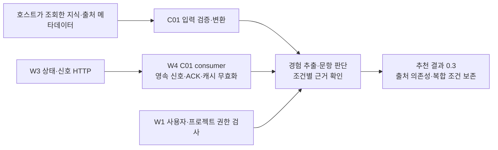

# W3 C01 r2 → W4 연결 구현 및 실행 안내

**후속 실제 실행:** [4모델 비교·실제 API 결과](w4-c01-live-evaluation-2026-09-17.md)에서 실제 호출 42회와 통합 품질 오류를 확인했다. 아래는 최초 C01 연결·모의 검증 기록이다. 최신 W1 연결 범위는 [백엔드 연결 계획](w4-w1-bridge-plan-2026-09-17.md)을 참조한다.

2026-09-17. **로컬 구현·통합 검증 완료, 팀 공동 채택과 운영 적용 전.**

고정 W3 커밋 `05f26b4c0a52aecf155a66df0fcaa38e6fbd4cf5`, profile `w3-c01/0.2-candidate/r2`를 소비하는 W4 어댑터를 구현했다. W3의 실제 localhost HTTP 서버와 W4 FastAPI 추천 경계를 연결했다. 기업 지식과 사용자 경험은 명시적인 가상 자료이고, 모델 응답은 모의 응답이다.

## 1. 실제 검증 결과

| 검사 | 결과 | 확인 범위 |
|---|---|---|
| W4 전체 회귀 | **292개 통과**, 실패·오류·생략 0 | 기존 256개 + 새 C01 검사 36개 |
| 기존 HTTP 시연 | 2개 통과, 기존 결과와 일치 | 기존 서버 입력 0.1 / 추천 출력 0.2 유지 |
| W3→W4 연결 시연 | **7개 통과** | W3 실제 localhost HTTP·SQLite + W4 FastAPI ASGI 경계 |
| 원본 스키마/샘플 | 6개 해시 일치, Git 저장 시 동일 바이트 | 전달받은 W3 원본의 의미·줄바꿈 유지 |
| 새 코드 정적 검사 | Ruff F 검사 통과 | 새 Python 파일의 미정의 이름·미사용 import 등 |
| 잠금 파일 | `uv lock --check --offline` 통과 | Python 범위별 의존성 잠금 확인 |

전체 회귀는 Windows / Python 3.12.14에서 실행했다. 새 변경의 Linux·GitHub Actions는 실행하지 않았다. C01 연결 시연의 모의 모델 호출은 12회, 실제 모델 호출은 0회다. 이전 W3 자체 테스트 197개 통과와 이번 W4 292개 통과는 서로 다른 검사다.

- [전체 검증 요약](../output/c01-integration-20260917/regression-2/summary.json)
- [최종 파일 해시·검증 기록](../output/c01-integration-20260917/implementation-verification.json)
- [테스트별 결과](../output/c01-integration-20260917/regression-2/tests.json)
- [실행 환경](../output/c01-integration-20260917/regression-2/environment.json)
- [C01 시연 요약](../output/c01-integration-20260917/http-demo-2/summary.json)
- [정상 추천 결과](../output/c01-integration-20260917/http-demo-2/recommendation.json)
- [재색인 후 새 추천 결과](../output/c01-integration-20260917/http-demo-2/recovered-recommendation.json)

첫 전체 실행은 Windows 테스트용 SQLite 연결 정리 오류 1개가 있어 실패했다. 테스트 연결을 명시적으로 닫도록 수정했고, 새 폴더 `regression-2`에서 292개 전체 검사를 다시 통과했다. 첫 실패 기록은 `regression-1`에 보존했다.

## 2. 새 연결 구조



공개 URL은 `POST /w4/recommend-from-raw`, 요청은 기존 `w4-service-input/0.1`이다. 사용자에게서 기업 지식, 소유자, 경험 원문, 모델 URL/키를 받지 않는다. 호스트의 `Backend.load_context`가 새 서버 입력을 공급한다.

| 구분 | 계약/파일 | 상태 |
|---|---|---|
| 서버 입력 | [w4-server-context/0.2](../schemas/w4-server-context-v2.schema.json) | W4 구현 제안 |
| W3 지식 수용 봉투 | [w4-c01-knowledge/0.1-proposal](../schemas/w4-c01-knowledge.schema.json) | W4 보완 계약, W3 정본 필드 추가 아님 |
| 추천 결과 | [w4-detailed-output/0.3](../schemas/w4-detailed-output-v3.schema.json) | C01 경로에서 반환 |
| 원본 wire 계약 | [c01_schemas](../epick_w4/c01_schemas/baseline.json) | W3 원본 5종과 fixture의 버전·해시 고정 |
| 가상 서버 입력 | [server-context.synthetic.json](../samples/c01/server-context.synthetic.json) | 고정 시계 샘플, 운영 데이터 아님 |

기존 서버 입력 0.1을 전달하면 기존 출력 0.2를 반환한다. C01 서버 입력 0.2에는 consumer 설정이 필수다. 새 Schema의 `signal/knowledge`는 원본 wire Schema와 런타임의 교차 필드 검사도 통과해야 한다. 봉투 Schema 하나의 구조 검사만으로 전체 계약을 검증했다고 표시하지 않는다.

각 Source binding에는 다음이 필요하다.

- `signal`: W3 사용 가능 신호 원문. 상태가 READY이고 로컬 영속 수신 상태와 맞아야 한다.
- `knowledge_generation`: **지식 처리를 시작한 때 확보한** generation. 최신 신호 번호를 과거 결과에 붙여서 대체하지 않는다.
- `knowledge`: 해당 Source/SourceVersion의 `StructureResponse`. 현재 어댑터는 Source당 응답 하나이며 여러 Source는 bindings 여러 개로 전달한다.
- `metadata`: 정확한 Source/IndexKey에 연결된 채용 범위, 원문 해시, 게시일·유효 기간, 파싱 상태, 필수 자료 여부, 보관 만료 시각. 호스트가 명시적으로 제공하는 정보다.

게시일·원문 해시·범위는 누락을 허용하는 nullable 필드이지만, 모르면 해당 근거를 추천에 사용하지 않는다. 관측 시각을 게시일로 바꾸거나 발췌 해시를 전체 원문 해시로 대체하지 않는다. 필수 자료가 제한되면 기업 기준 전체를 사용하지 않는다. W3 출처 자체가 차단되거나 현재 상태가 달라지면 해당 실행은 409/503으로 중단한다.

W3 원본 fixture는 Claim/Requirement가 없는 LIMITED 예제다. 이 원본을 정상 기업 분석으로 바꾸지 않았다. 별도의 W4 가상 자료 2개에만 예시 Claim과 복합 요건을 작성했다. 그 VERIFIED/USABLE은 테스트 전제이며 실제 SK하이닉스 검증 결과가 아니다.

## 3. 코드별 역할

| 파일 | 하는 일 |
|---|---|
| [c01_contract.py](../epick_w4/c01_contract.py) | 새 서버 봉투·출력 타입, 호스트 메타데이터 정의 |
| [c01_adapter.py](../epick_w4/c01_adapter.py) | 원본 Schema·Source/Version·generation·발췌 해시·근거 참조·조건 트리 검사, W4 입력 변환 |
| [c01_consumer.py](../epick_w4/c01_consumer.py) | SQLite 신호 저장, 상태 재검사, 영속 처리 후 ACK, 사용자/프로젝트별 추천 캐시와 전체 Source 의존성 무효화 |
| [c01_detail.py](../epick_w4/c01_detail.py) | 조건 LEAF별 의미 판단 입력/출력, 코드의 AND/OR 합산, C01 프롬프트·전송 Schema |
| [service_adapter.py](../epick_w4/service_adapter.py) / [api.py](../epick_w4/api.py) | 기존 사용자 범위·권한 검사에 C01 현재성 검사를 연결하고 안전한 HTTP 오류 반환 |
| [detailed_recommendation.py](../epick_w4/detailed_recommendation.py) / [company_detail.py](../epick_w4/company_detail.py) | C01 판단 경로 선택과 결과 0.3 조립 |
| [synthetic_policy.py](../epick_w4/synthetic_policy.py) / [output_schemas.py](../epick_w4/output_schemas.py) | 실제 전송 시 고정 가상 자료 허용 목록과 새 응답 Schema 적용 |
| [w4_c01_demo.py](../examples/w4_c01_demo.py) | 명시적 가상 기업자료·경험, 모의 모델·W3 상대역 생성 |
| [test_c01_integration.py](../tests/test_c01_integration.py) | 실제 W4 API를 호출하는 정상·차단·복구·권한·트랜잭션·조건 트리 회귀 36개 |
| [demo-c01-integration.py](../scripts/demo-c01-integration.py) | 전달 W3를 실제 localhost 서버로 띄운 연결 시연 |

서로 다른 Source에 같은 Evidence/후보 ID가 있어도 섞이지 않도록 W4 내부 식별자를 파생한다. 원래 ID와 원문 위치·발췌·무결성 정보·검증 상태·제한 사유는 provenance와 upstream_record/details에 보존한다. `FAILED`를 `REJECTED`, `BLOCKED`를 `WITHDRAWN`으로 임의 치환하지 않는다. `GENERAL` 요건도 별도 값으로 유지한다.

## 4. 판단·저장 보장과 한계

LLM은 경험 하나 안에서 조건 LEAF별 근거를 제시한다. 코드는 빠진/중복된 조건, 다른 경험의 구간, 본인 행동이 아닌 근거를 검사한 뒤 AND/OR 결과를 합산한다. 예를 들어 A AND (B OR C)는 A와 B 근거가 있으면 충족하지만, A만 있으면 충족으로 표시하지 않는다. 요건의 원문·예외·비교 기준·동일 경험 조건은 모델 입력과 결과에 보존한다.

이 판정은 원문에서 확인한 소재의 관련성이다. 전체 지원 자격은 계속 `NOT_ASSESSED`다. 정렬 정책은 기존 문항 부합 상태 → 근거 종류 수 → 경험 ID이며, 기업 조건을 새 가산점으로 더하지 않는다. 새 C01 프롬프트의 실제 모델 정확도는 아직 측정하지 않았다.

캐시에는 전체 서버 문맥·요청·소유 범위를 반영한 키와 **입력에 포함된 모든 Source**의 의존 관계를 저장한다. 사용된 추천 근거만으로 의존 범위를 줄이지 않는다. `drain()`은 한 페이지를 처리하며 다음을 보장한다.

- 신호 상태와 영향받는 결과 삭제를 같은 트랜잭션에 반영한 뒤 ACK한다. 저장 실패 시 ACK하지 않는다.
- 같은 신호의 중복 처리로 유효한 캐시를 지우지 않는다. 낮은 generation은 최신 상태를 되돌리지 않는다.
- 같은 generation의 다른 내용 또는 순번 역전은 충돌로 처리하고 캐시를 삭제한다.
- 모델 호출 전과 최종 반환 경계에서 W1 권한·문맥 및 W3 최신 status를 다시 검사한다. 조회 실패 시 캐시를 반환하지 않는다.
- cleared만으로 재사용하지 않는다. 현재 두 순번·전체 IndexKey·generation·READY가 맞는 새 지식을 요구한다. snapshot 후 history_complete=false를 단독 영구 차단 사유로 쓰지 않는다.
- TTL 만료 시 논리 캐시를 삭제한다. 캐시 수명이 host의 명시적 최대 TTL과 Source metadata 만료 시각을 넘지 않도록 제한한다.

SQLite는 단일 논리 consumer의 로컬 구현이다. 여러 서비스 replica 사이의 outbox 분배·공유 저장소·일관성은 별도 운영 설계다. 유휴 시 삭제를 위한 `purge_expired()` 주기 호출, 재시도 간격/횟수/DLQ, SQLite 잔여 페이지/WAL/백업의 물리 삭제는 host 운영 정책에 남아 있다.

W1 `authorize`를 가상 구현으로 검증했으며 W1 실제 인증·DB·개인 삭제 epoch/fence·결과 게시 트랜잭션은 연결하지 않았다. W4의 로컬 캐시 저장은 W1 Job 완료/화면 게시 ACK가 아니다. 공개 W3 신호가 W1 권한을 복구하지 않는다. W1 게시 직전과 재조회 시점의 권한·버전 검사도 필요하다.

## 5. 호스트에서 연결하기

```python
from epick_w4.api import create_service_router
from epick_w4.c01_consumer import C01Consumer, C01HTTPTransport

transport = C01HTTPTransport(settings.w3_base_url, settings.w3_w4_token)
consumer = C01Consumer(
    settings.w4_c01_database_path,
    transport=transport,
    max_cache_ttl_seconds=settings.w4_cache_ttl_seconds,
)
consumer.drain()  # 초기 한 페이지; 이후 호출은 host worker가 담당
app.include_router(create_service_router(
    authenticate=authenticate_user,
    backend=backend,
    extraction_client_factory=create_extractor,
    client_factory=create_judge,
    c01_consumer=consumer,
))
```

Backend의 `load_context`는 [서버 입력 예제](../samples/c01/server-context.synthetic.json) 형식을 공급하고, `authorize`는 현재 사용자·프로젝트·삭제·동의 정책을 검사해야 한다. 신호 수신 worker와 만료 purge, 종료 시 consumer.close()는 host가 관리한다. 예제 TTL 120/300/3600초는 테스트 설정이며 운영 보관 기간을 확정한 값이 아니다.

URL/토큰은 서버 설정에서 받으며 HTTP는 loopback만 허용한다. 원격 연결은 HTTPS를 사용하고 리다이렉트로 토큰을 전달하지 않는다. 상태 wire 버전에 r2 profile이 독립적으로 들어 있지는 않으므로, host가 W3 배포를 고정 commit/profile에 맞춰야 한다. 새/외부 DB 또는 profile 설정이 다른 DB를 조용히 이행하지 않는다.

원래 W3 r2와 정확히 같은 wire 의미를 사용한다. Source 단위 restriction 순번 선택, P4/P5, 운영 TTL은 공동 채택 조건으로 남는다. READY는 근거 색인 사용 가능 상태이며 모든 Claim의 사실성이나 W1 사용자 접근 권한을 대신하지 않는다.

## 6. 재현 명령

W4 저장소 루트에서 실행한다. 출력 폴더는 매번 새 이름을 사용한다.

```powershell
uv sync --locked --extra api --extra test
uv run --locked --extra api --extra test python scripts/verify_service_handoff.py --output-dir output/c01-review-new
```

W3 실제 로컬 서버를 포함하는 시연은 받은 r2 ZIP을 별도 폴더에 풀고, 그 폴더에서 `uv sync --locked`로 W3 환경을 준비한 뒤 실행한다. W3는 Python 3.12 이상이 필요하다.

```powershell
uv run --locked --extra api --extra test python scripts/demo-c01-integration.py --w3-root output/w3-c01-review-20260917/received --output-dir output/c01-http-new
```

이 명령은 전달본 manifest와 commit을 확인하고 localhost 서버를 시작한 뒤 종료한다. W2 public event는 시연용 가상 생성물, 기업 지식은 명시적인 합성 StructureResponse, 모델은 모의 응답이다. 실제 W2 생산 코드나 W3 의미 추론·LLM 성능을 검증했다고 표시하지 않는다.

Local/Solar 전송 경로에는 C01 stage와 응답 Schema를 연결했다. 실제 호출은 등록된 가상 기준·경험·문항만 허용하며, 이번에는 호출하지 않았다. 모델 재평가와 운영 선정은 별도 작업이다.

## 7. 팀에 전달할 것

[A1–A5 적용 결과 회신 초안](w4-c01-adoption-reply-2026-09-17.md), 이 실행 안내, 위 코드·Schema·가상 샘플, `regression-2`와 `http-demo-2` 결과를 함께 전달한다. `api.py`만 복사하면 어댑터·Schema·의존성·검증이 빠진다.

현재 변경은 주 작업 폴더에 있으며, 기존 전달용 worktree는 변경하지 않았다. 이번 변경의 새 커밋·원격 푸시·PR·GitHub CI는 생성하지 않았다. 공동 채택 완료로 서명하거나 외부 메시지를 전송하지 않았다.
